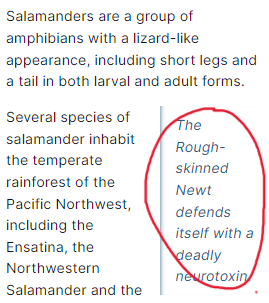

# HTML

- ## 정의
  Hypertext Markup Language(HTML), 웹페이지의 구조를 정의하는 마크업 언어.
- ## 문서
  - https://developer.mozilla.org/ko/docs/Web/HTML
  - https://www.w3schools.com/html/default.asp
  - https://google.github.io/styleguide/htmlcssguide.html (구글 권장 가이드라인)
- ## 용어

  DOM(Document Object Model)

  - HTML문서를 브라우저가 이해할 수 있도록 만든 Tree 자료구조.
  - 문서의 계층적 구조와 정보를 표현.
  - 
    > 출처 : https://velog.io/@sj_dev_js/HTML-DOM%EC%9D%B4%EB%9E%80-%EB%AC%B4%EC%97%87%EC%9D%BC%EA%B9%8C

  시멘틱 태그(Semantic Tag)

  - HTML5에서 등장한 개념으로, HTML의 구조를 설계 할 때 태그에 의미를 부여하여 웹사이트의 구조를 쉽게 파악 할 수 있도록 함.
  - 접근성 향상, SEO(검색엔진최적화) 향상, 가독성 향상의 장점이 있음.
    ```HTML
    <article>
    <aside>
    <details>
    <figcaption>
    <figure>
    <header>
    <footer>
    <main>
    <mark>
    <nav>
    <section>
    <summary>
    <time>
    ```

  블럭요소(block element)와 인라인요소(inline element)

  - 블럭요소 : 태그하나가 브라우저에서 좌우공간을 다 차지하는 독립적 덩어리.
    - 블럭요소와 인라인요소 모두 포함 가능. (주의 : h1 - h6, p는 인라인 요소만 포함.)
  - 인라인요소 : 한 태그가 코딩 된 영역만을 차지하며 다른 태그와 나란히 사용 가능.

    - 인라인요소만 포함 가능.
    - css로 블럭화 하여 블럭요소 포함 가능하지만 유효성에 어긋남.

    

    > 출처 : https://sdsupport.cafe24.com/reference/html/block-inline.html

- ## 구조

  ```HTML
  <!DOCTYPE html>
  ```

  - 현재 웹문서가 HTML5로 작성 된 문서임.
  - ! + tab 또는 html:5 로 미리 짜여진 형식 사용 가능.

  ```HTML
  <html>
    <!-- HTML요소 -->
  </html>
  ```

  - HTML문서의 시작에서 끝까지 DOCTYPE를 제외한 모든 HTML요소를 포함함.
  - 브라우저에게 HTML문서임을 알림.

  ```HTML
  <head>
    무조건 헤드에
    ------------
    <title>
    <base>
    <link>
    <style>
    <meta>
    ------------
    다른데 넣어도됨
    <script>
    <noscript>
    <template>
  </head>
  ```

  - 브라우저가 해석하는데 필요한 정보를 입력.
  - HTML5부터 head가 생략이 가능하나 비추천.
  - ```HTML
    <title>내용</title>
    ```
    - 브라우저의 제목이나 탭의 문서 제목을 정의. 텍스트만 사용가능.
  - ```HTML
    <base href="/examples/images/" target="_blank|_self|_parent|_top|프레임 이름">
    ```
    - 해당 문서의 모든 상대주소의 기본 주소 또는 tartget 속성값을 정의.
    - 문서 당 하나만 있어야 하며 복수일 경우 첫 번째만 사용.
    - tartget 속성값은 순서대로 "새로운탭|현재프레임(default)|현재프레임의 부모프레임|현재윈도우전체|명시된프레임".
  - ```HTML
    <link href="main.css" rel="stylesheet" />
    <link href="favicon.ico" rel="icon"  />
    ```
    - 현재 문서와 외부 리소스의 관계를 표현.(href : 경로, rel : 현재문서와의 관계)
    - 주로 스타일 시트 연결에 사용하지만 사이트 아이콘 연결 등에도 사용.
  - ```HTML
    <style>
      p {
        color: #0000;
      }
    </style>
    ```
    - 문서의 스타일 정보를 포함.
    - 다수의 style과 link 요소를 포함 할 시 순서대로 DOM에 적용함. 주의.
    - 보통 외부 스타일 시트에 작성 후 link 하는 것이 일반적.
  - ```HTML
    <!-- 문서의 문자 인코딩을 지정하는 메타 태그. 여기서는 UTF-8 인코딩을 사용. -->
    <meta charset="UTF-8" />

    <!-- 웹페이지의 동작을 제어하는 태그. 여기서는 5초 뒤 다른 페이지로 리다이렉트. -->
    <meta http-equiv="refresh" content="5;url=새페이지.html">

    <!-- 렌더링 엔진이 해당 문서를 최신 버전의 Internet Explorer로 렌더링하도록 지정하는 메타 태그. -->
      <meta http-equiv="X-UA-Compatible" content="IE=edge" />

    <!-- 검색 엔진을 위한 키워드를 정의. -->
      <meta name="keyword" content="HTML, meta, tag, element, reference" />

    <!-- 웹 페이지에 대한 설명(description)을 정의. -->
      <meta name="description" content="HTML meta tag page" />

    <!-- 문서의 저자(author)를 정의. -->
      <meta name="author" content="TCPSchool" />

    <!-- 모든 장치에서 웹 사이트가 잘 보이도록 뷰포트(viewport)를 설정.  -->
      <meta name="viewport" content="width=device-width, initial-scale=1.0" />
      <title>HTML meta tag</title>
    ```

    - HTML 문서에서 다양한 메타데이터(문서에 관한 추가 정보)를 제공하여 브라우저가 문서를 해석하고 처리하는데 활용.

  - ```HTML
    <script>
      doucument.write("Hellow World");
    </script>

    <script src="example/main.js"></script>
    ```

    - HTML문서에 클라이언트 사이드 스크립트(브라우저가 해석하여 작동하는 스크립트 ex:JS)를 추가.
    - 브라우저의 동작을 제어하거나 실행가능한 코드를 문서에 포함하고 싶을 때.
    - 보통 body 최하단에 위치 -> 이유 : https://lovelysnowi113.tistory.com/1327

  - ```HTML
    <noscript>
      <p>이러면 못써용!<p>
    </noscript>
    ```
    - 스크립트를 지원하지 않거나 비활성화 된 경우 보여줄 내용.
  - ```HTML
    <template id="render">
      <p>보여질거야<p>
    </template>

    <div id = "target">div 태그</div>

    // JS 코드
    let target = document.querySelector('#target');
    let template = document.querySelector('#render');

    // render 안쪽 내용을 복사 (자식노드를 전부 포함해서)
    let newContent = document.importNode(template.content,true);

    target.innerHTML = '';
    target.appendChild(newContent);

    <!-- 결과 -->
    <div id = "target">
      <p>보여질거야<p>
    </div>
    ```

    > 출처 : https://coding-basketball.tistory.com/3

    - 추가되거나 복사될 수 있는 HTML 요소들을 정의.
    - 페이지 로드시 렌더링 되지 않으며, JS를 이용하여 복제 한 후 보이도록 할 수 있음(원하는 만큼 중복 사용가능).

  ```HTML
  <body>
    <p>문단입니다</p>
  </body>
  ```

  - 브라우저에 나타나는 내용.
  - 문서 당 하나의 body만 존재 가능.
  - HTML5에선 레이아웃 관련 속성 지원하지 않음.

  - ```HTML
    <header>
        <h3>날씨 정보</h4>
        <h4>2월 19일</h4>
        <p>- 기상청 제공 -</p>
    </header>
    <p>서울 : 맑음</p>
    <p>대전 : 흐림</p>
    <p>부산 : 비</p>
    ```
    - 문서나 section의 헤더를 정의.
    - 도입부 또는 네비게이션 링크 집합 등을 포함.
  - ```HTML
    <nav>
      <a href="/html/intro">HTML</a> |
      <a href="/css/intro">CSS</a> |
      <a href="/javascript/intro">JavaScript</a>
    </nav>
    ```
    - 같은 웹 문서 안 다른 위치 또는 다른 웹 문서에 연결.
    - 네비게이션 링크들의 집합을 정의. ex : 목차 or 인덱스.
    - header sidebar footer에 모두 사용 가능.
  - ```HTML
    <article>
      <h2>2월 19일 날씨 정보</h2>
      <h3>서울</h3>
      <p>맑음</p>
      <h3>대전</h3>
      <p>흐림</p>
      <h3>부산</h3>
      <p>비</p>
    </article>
    ```
    - 독립적으로 배포가 가능하거나 재사용 가능한 콘텐츠를 묶음. ex : 블로그 포스트, 포럼, 뉴스기사
    - article 내부에 article 존재 가능.
  - ```HTML
    <section>
      <h1>HTML</h1>
      <p>HTML(HyperText Markup Language).</p>
    </section>
    <section>
        <h1>HTML의 역사</h1>
        <p>최초의 HTML은 어쩌고 저쩌고.</p>
    </section>
    ```
    - 논리적으로 관계있는 요소 또는 문서를 분리할 때 사용.(논리적인 관계가 없을 때는 div 사용.)
  - ```HTML
    <section>
      <h1>HOT TOPIC</h1>
      <section>
        <p>World</p>
        <article>World news 1</article>
        <article>World news 2</article>
        <article>World news 3</article>
      </section>
      <section>
        <p>Sport</p>
        <article>Sport news 1</article>
        <article>Sport news 2</article>
        <article>Sport news 3</article>
      </section>
    </section>
    ```
    - article과 section의 차이는 article은 독립적인 요소들을 묶는다는 점 article이 좀 더 구체적임 section은 논리적인 관계를 기준으로 묶는다는 점.
    - 두 시멘틱 태그 모두 div와 같은 블록 요소이기 때문에 대체하더라도 기능 상 문제는 없음.
    - 태그 내 콘텐츠가 외부와 단독으로 묶는게 낫다면 article 사용.
  - ```HTML
    <main>
      <h1>바나나</h1>
      <p>바나나는 바나나는 파초과 바나나 속에 속하는 숙근성 영년생 열대과수를 총칭한다.</p>
      <article>
          <h2>다이어트 식품</h2>
          <p>바나나는 탄수화물이 약 27%이고 비타민 A와 C가 풍부하며, 100g당 87kcal의 열량을 갖는다.</p>
      </article>
      <article>
          <h2>다양한 섭취법</h2>
          <p>바나나는 열매를 주식으로 이용할 뿐 아니라 미성숙한 열매는 채소로 다양한 요리에 응용된다.</p>
      </article>
    </main>
    ```
    - 문서 내 body의 주 콘텐츠 작성.
    - 중심 주제나 주요 기능에 직접 연관이 있어야 하고, 문서 전반에 반복되는 내용은 포함하지 않음.
    - 한 문서에는 하나의 main만 존재. article, aside, footer, header, nav 요소의 자손이 되어선 안됨.
  - ```HTML
    <h2>과메기</h2>
    <p>과메기는 경상북도 포항 지역의 특산물로 청어나 꽁치를 추운 겨울 동안 얼렸다 녹였다를 반복하여 반건조시킨 음식이다.</p>
    <aside>
        <h4>포항</h4>
        <p>포항시는 대한민국 경상북도 동해안에 위치하고 있으며, 포항시 중심을 관통하는 형산강이 영일만에 유입되면서
            넓은 충적평야를 형성하고 있다.</p>
    </aside>
    ```

    - 다른 콘텐츠 들과 약간 연관있지만 분리 시킬 수 있는 내용.

      

      > 출처 : https://developer.mozilla.org/ko/docs/Web/HTML/Element/aside

  - ```HTML
    <footer>
      <p>Copyright © 2018 tcpschool.co.,Ltd. All rights reserved.</p>
      <address>Contact webmaster for more information. 070-1234-5678</address>
    </footer>
    ```
    - 문서나 섹션의 footer 정의.
    - header,section, article 등의 시멘틱 태그 사용 가능.
  - ```HTML
    <style>
      div {
          background-color: orange;
          font-style: italic;
      }
    </style>

    <div>
      <p>div 요소는 다른 HTML 요소들을 하나로 묶는 데 자주 사용되는 대표적인 블록(block) 요소입니다.</p>
    </div>
    ```

    - 문서의 영역이나 구획을 정의.
    - HTML요소를 묶어 CSS로 스타일 변경 시 사용.
    - JS 컨테이너로 사용.
    - HTML5에선 align 속성 미지원.

  - ```HTML
    <h1>
     ...
    <h6>
    ```
    - 크기별 제목 텍스트.
  - ```HTML
    <p>이 문장은 단락입니다.</p>
    ```
    - 문단을 정의.
    - 브라우저에서 자동으로 위 아래에 여백 생성.
    - 태그 내 줄바꿈에 영향 받지 않음.
  - ```HTML
    <br>
    ```
    - 텍스트 내 줄바꿈 정의.
    - 종료 태그 없음.
  - ```HTML
    <p>애국가 1절</p>
    <blockquote>
      동해 물과 백두산이 마르고 닳도록
      하느님이 보우하사 우리나라 만세.
      무궁화 삼천리 화려 강산
      대한 사람, 대한으로 길이 보전하세.
    </blockquote>

    <p>
    동해 물과 백두산이 마르고 닳도록
    하느님이 보우하사 우리나라 만세.
    <q cite="https://ko.wikipedia.org/wiki">애국가 1절</q>
    </p>
    ```

    - 들어쓰기를 사용하며 인용구 정의.
    - 짧은 인용구의 경우 q태그 사용("").

      

      > 출처 : https://coding-factory.tistory.com/888

      

      > 출처 : https://coding-factory.tistory.com/889

  - ```HTML
    <p><strong>주의!</strong>주의하라고</p>
    <p><b>주의!</b>주의하라고</p>
    ```
    - 둘 다 굵게 강조 됨.
    - strong은 스크린 리더가 읽을 때 거센 억양으로 강조해서 읽음.
    - 보통 CSS로 대체.
  - ```HTML
    <p><em>기울어진다</em>이테리체네</p>
    <p><i>기울어진다</i>이테리체네</p>
    ```
    - 둘 다 이테리체로 기울여서 표기.
    - em은 스크린 리더가 읽을 때 거센 억양으로 강조해서 읽음.
    - 보통 CSS로 대체.
